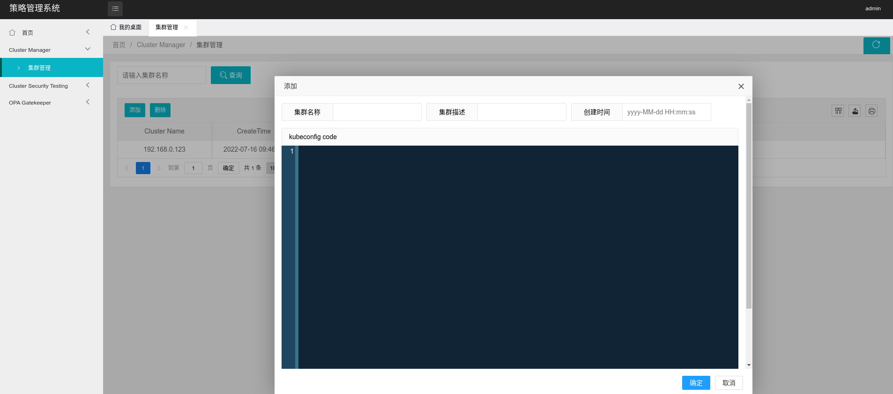
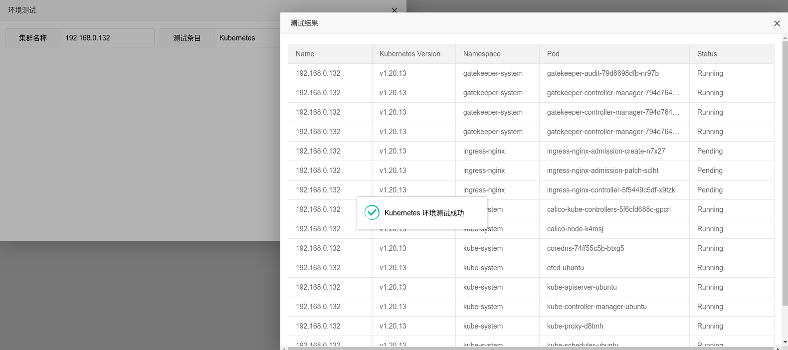
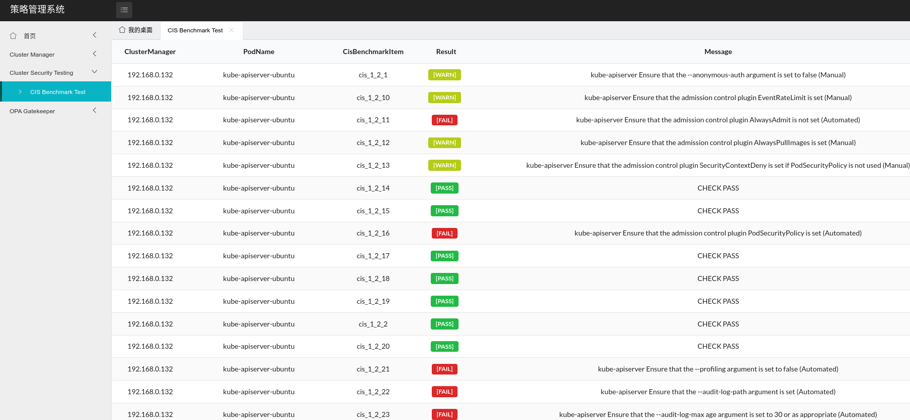
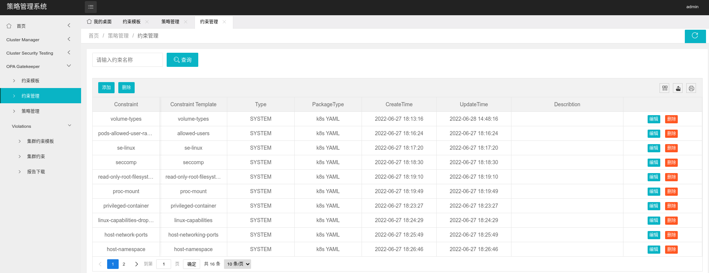
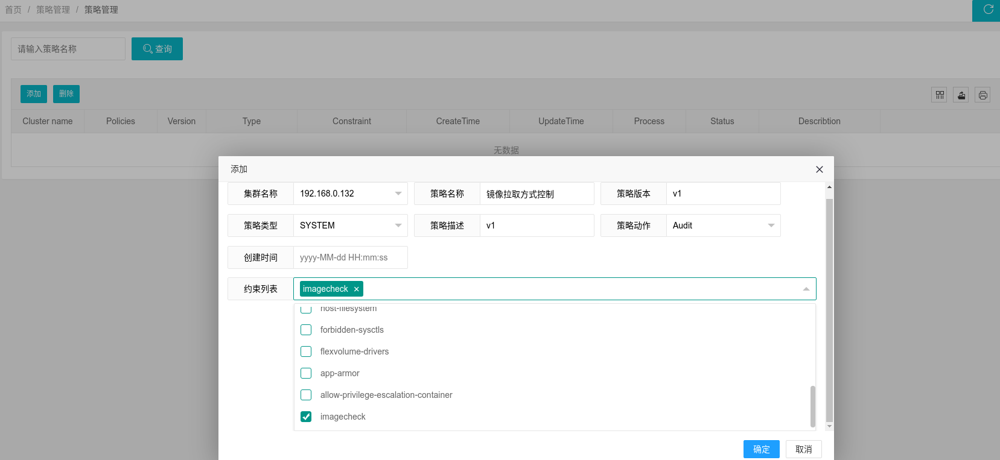
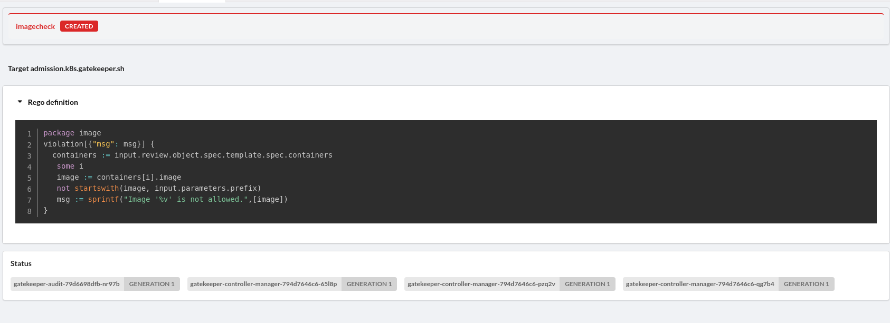
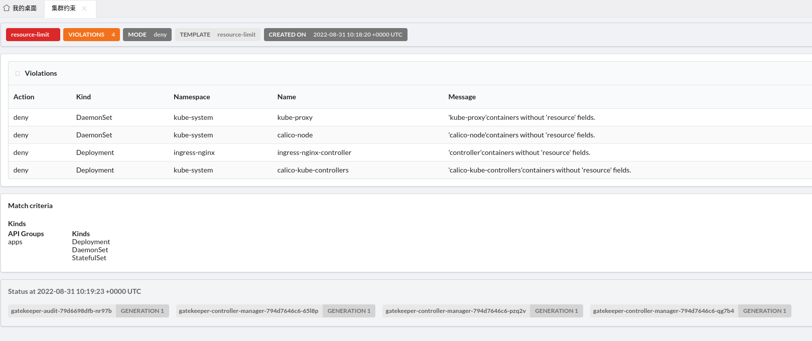

<h1>
 

</h1>

**CCBR is a policy management system project. It uses the policy language Rego to implement the CIS benchmark test of cloud native kubernetes. In addition, it integrates gatekeeper, manages its constraint templates, constraints and policies, and supports policy deployment and audit inspection.**


## Requirement：
1. Go (https://go.dev/)  

2. Gatekeeper (https://github.com/open-policy-agent/gatekeeper)  

3. Kubernetes (https://kubernetes.io/)  

4. mysql

## Installation
1. Importing ccbr.sql to mysql

2. Modifying Code utils/MysqlUtils Database Connection
```go
   func InitDB() *sqlx.DB {
	database, err := sqlx.Open("mysql", "mysql:test123789@tcp(127.0.0.1:3306)/policymanager")
	if err != nil {
		fmt.Println("open mysql failed,", err)

	}
	return database
}
```

3. Go build compilation project
   ```go
   go build
   ```

4. ./ccbr run

## Document
At present, the ccbr mainly includes two functions. The first function is to use the Rego language to detect the kubernetes security baseline, and the second function is a policy management system. The policy management system integrates an Gatekeeper, including functions such as a constraint template, constraint management, and policy management.

1. In the CIS Benchmark test, it is necessary to configure the config file of kubectl of kubernetes. The default location of config is –/.kube/config.
   ```go
    ./ccbr kubernetes --help
   ```
   

2. Cis benchmark Single Item Test
   ```go
   ./ccbr kubernetes -c "cis_1_2_11"
   ```
    

3. Cis benchmark Multi-Item Test
   ```go
   ./ccbr kubernetes -c "cis_1_2_11,cis_1_2_12"
   ```
    

4. By default, all CIS Benchmark tests are performed.
   ```go
   ./ccbr kubernetes 
   ```
    

## ccbr policy management system
 The policy management system integrates an Gatekeeper, including functions such as a constraint template, constraint management, and policy management.
 1. Start the policy management system service of the ccbr. The web browser accesses   (http://127.0.0.1:9876).
   ```go
   ccbr run
   ```
   

 2. To configure the kubernetes cluster environment, click Cluster Manager-> Cluster Management.  
     
    2.1. Click Add. Set the cluster name, cluster description, and kubectl config file of the kubernetes, and save the configuration. In this case, if the kubernetes is accessed through a certificate, you need to copy the corresponding certificate on the local server in accordance with the config configuration to remotely connect to the kubernetes cluster.  

    

    2.2. Added successfully. You can edit it.  

    

    
         
    2.3.Perform a kubernetes cluster test to verify that the config file is correct.Click Test, The Test dialog box is displayed. Select the corresponding test item. Two types of test items are supported: Kubernetes and Gatekeeper. Because policy management is based on the Gatekeeper component, the Gatekeeper environment must be installed for the kubernetes cluster.    

     

3. Kubernetes Cluster Security Test
   
   At present, the Kubernetes cluster security test only supports the CIS Benchmark test. More tools will be added in the future.

   Select Cluster Security test->CIS Benchmark Test. The kubernetes cluster environment configured for the 2.1 is automatically tested.

   

4. OPA Gatekeeper integration

   The policy management system performs cluster policy management based on Gatekeeper. The current functions include constraint template management, constraint management, and policy management. 

   4.1 Constraint Template Management
     
     At present, 16 constraint templates are built in. You can modify them as required and add customized constraint templates.

     

   4.2 Constraint Management
     
     Based on the sixteen constraint templates built in the 4.1, the sixteen-day constraint management is embedded. You can modify the template as required and add customized constraints.

     

   4.3 Policy Management

     Policy management is mainly responsible for policy management. Click Add. The Policy Management page is displayed. Set the cluster name, policy name, policy version, policy action, and constraints.

     

     

   4.4 Policy Deployment
     
      Click the policy deployment button to deploy the policy

5. Policy audit

   The policy audit is mainly reflected in the violations directory, which mainly includes the functions of viewing the policy constraint template, viewing the policy constraint, and downloading the deployment policy audit report.

   5.1 Policy constraint template view
    
    

    Click view to view the detailed definition of the policy constraint template

    

   5.2 Policy constraint view

    

    

   5.3 Audit Report Download
    
    
     

## ccbr reference

1. [opa](https://github.com/open-policy-agent/opa)

2. [gatekeeper-policy-manager](https://github.com/sighupio/gatekeeper-policy-manager)

3. [gatekeeper-library](https://github.com/open-policy-agent/gatekeeper-library) 


